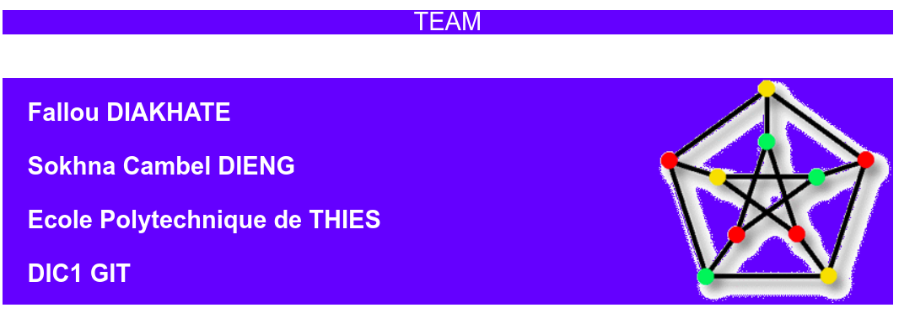
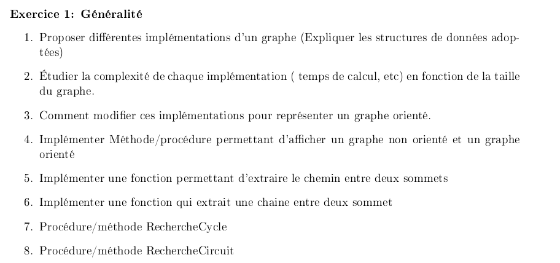
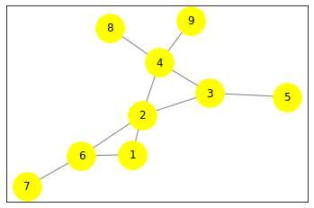
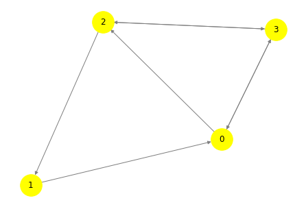
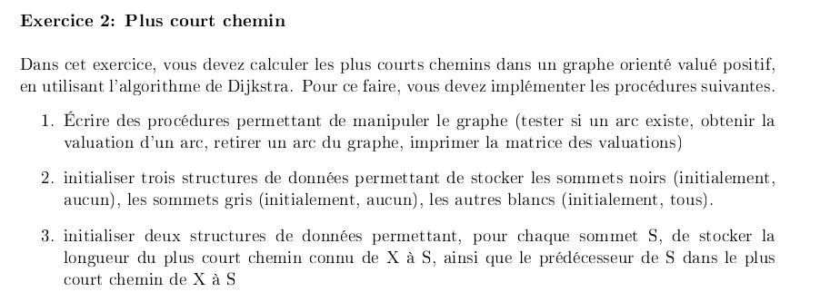
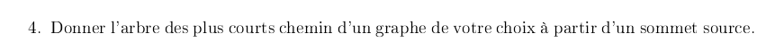

<hr>

<h1><center style="background-color : blue; color:white">EXERCICE 1 : GENERALITE</center></h1>


<hr>

`RESOLUTION`

`1. Proposons différentes implémentations d'un graphe (Expliquer les structures de données adoptées)`

Les graphes peuvent être implémentés en Python de plusieurs façons. On en a choisi deux :

* IMPLEMENTATION PAR LISTE D'ADJACENCE :

Le graphe est considéré comme un dictionnaire, où les clés sont les sommets et les valeurs, les sommets reliés aux clés.


```python
def adjacencyList(self):
        if len(self.vertices) >= 1:
            return [str(key) + ":" + str(self.vertices[key]) for key in self.vertices.keys()]
        else:
            return dict()
```

* IMPLEMENTATION PAR MATRICE D'ADJACENCE :


```python
def adjacencyMatrix(self):
        if len(self.vertices) >= 1:
            self.vertex_names = sorted(g.vertices.keys())
            self.vertex_indices = dict(zip(self.vertex_names, range(len(self.vertex_names))))
            import numpy as np
            self.adjacency_matrix = np.zeros(shape=(len(self.vertices), len(self.vertices)))
            for i in range(len(self.vertex_names)):
                for j in range(i, len(self.vertices)):
                    for el in g.vertices[self.vertex_names[i]]:
                        j = g.vertex_indices[el]
                        self.adjacency_matrix[i, j] = 1
            return self.adjacency_matrix
        else:
            return dict()
```

CODE ET TEST


```python
class Vertex:
    def __init__(self, vertex):
        self.name = vertex
        self.neighbors = []

    def add_neighbor(self, neighbor):
        if isinstance(neighbor, Vertex):
            if neighbor.name not in self.neighbors:
                self.neighbors.append(neighbor.name)
                neighbor.neighbors.append(self.name)
                self.neighbors = sorted(self.neighbors)
                neighbor.neighbors = sorted(neighbor.neighbors)
        else:
            return False

    def add_neighbors(self, neighbors):
        for neighbor in neighbors:
            if isinstance(neighbor, Vertex):
                if neighbor.name not in self.neighbors:
                    self.neighbors.append(neighbor.name)
                    neighbor.neighbors.append(self.name)
                    self.neighbors = sorted(self.neighbors)
                    neighbor.neighbors = sorted(neighbor.neighbors)
            else:
                return False

    def __repr__(self):
        return str(self.neighbors)


class Graph:
    def __init__(self):
        self.vertices = {}

    def add_vertex(self, vertex):
        if isinstance(vertex, Vertex):
            self.vertices[vertex.name] = vertex.neighbors

    def add_vertices(self, vertices):
        for vertex in vertices:
            if isinstance(vertex, Vertex):
                self.vertices[vertex.name] = vertex.neighbors

    def add_edge(self, vertex_from, vertex_to):
        if isinstance(vertex_from, Vertex) and isinstance(vertex_to, Vertex):
            vertex_from.add_neighbor(vertex_to)
            if isinstance(vertex_from, Vertex) and isinstance(vertex_to, Vertex):
                self.vertices[vertex_from.name] = vertex_from.neighbors
                self.vertices[vertex_to.name] = vertex_to.neighbors

    def add_edges(self, edges):
        for edge in edges:
            self.add_edge(edge[0], edge[1])

 

    def adjacencyList(self):
        if len(self.vertices) >= 1:
            return [str(key) + ":" + str(self.vertices[key]) for key in self.vertices.keys()]
        else:
            return dict()

    def adjacencyMatrix(self):
        if len(self.vertices) >= 1:
            self.vertex_names = sorted(g.vertices.keys())
            self.vertex_indices = dict(zip(self.vertex_names, range(len(self.vertex_names))))
            import numpy as np
            self.adjacency_matrix = np.zeros(shape=(len(self.vertices), len(self.vertices)))
            for i in range(len(self.vertex_names)):
                for j in range(i, len(self.vertices)):
                    for el in g.vertices[self.vertex_names[i]]:
                        j = g.vertex_indices[el]
                        self.adjacency_matrix[i, j] = 1
            return self.adjacency_matrix
        else:
            return dict()


    def graphList(self):
        return str(self.adjacencyList())
    
    def graphMatrix(self):
        return str(self.adjacencyMatrix())
```

* Initialisation du graphe


```python
a = Vertex('A')
b = Vertex('B')
c = Vertex('C')
d = Vertex('D')
e = Vertex('E')

a.add_neighbors([b, c, e])
b.add_neighbors([a, c])
c.add_neighbors([b, d, a, e])
d.add_neighbor(c)
e.add_neighbors([a, c])
```

* Affichage


```python
g = Graph()
g.add_vertices([a, b, c, d, e])
g.add_edge(b, d)
print("****************************** REPRESENTATION PAR LISTE D'ADJACENCE **********************************\n\n {0}\n".format(g.graphList()))
print("****************************** REPRESENTATION PAR MATRICE D'ADJACENCE **********************************\n\n {0}\n".format(g.graphMatrix()))
```

    ****************************** REPRESENTATION PAR LISTE D'ADJACENCE **********************************
    
     ["A:['B', 'C', 'E']", "B:['A', 'C', 'D']", "C:['A', 'B', 'D', 'E']", "D:['B', 'C']", "E:['A', 'C']"]
    
    ****************************** REPRESENTATION PAR MATRICE D'ADJACENCE **********************************
    
     [[0. 1. 1. 0. 1.]
     [1. 0. 1. 1. 0.]
     [1. 1. 0. 1. 1.]
     [0. 1. 1. 0. 0.]
     [1. 0. 1. 0. 0.]]
    


<hr>
<hr>

`2. Étudions la complexité de chaque implémentation ( temps de calcul, etc) en fonction de la taille du graphe.`

* LISTE D'ADJACENCE

Il est très facile de déterminer tous les voisins d'un sommet particulier. En fait, récupérer les voisins d'un nœud prend un temps constant , O (1) , car tout ce que nous avons vraiment à faire est de trouver l'index du nœud que nous recherchons et d'extraire sa liste de sommets adjacents.
Pour trouver une arête spécifique, nous pourrions finir par parcourir toute la liste chaînée pour la vérifier, ce qui nous prendra du temps O (d) , où d est le degré de sommet x.
 
Une liste d'adjacence elle-même nécessitera | V | quantité d'espace pour la liste, car chaque sommet nécessitera son propre index et son propre emplacement dans la liste.

* MATRICE D'ADJACENCE

Les valeurs de la matrice de contiguïté sont comme des indicateurs de drapeau booléen; ils sont soit présents, soit absents. Si la valeur est 1, cela signifie qu'il y a une arête entre les deux nœuds; si la valeur est 0, cela signifie qu'il n'existe pas d'arête entre eux.

La chose intéressante à propos des représentations matricielles d'adjacence d'un graphe est que, simplement en les regardant, nous pouvons dire si le graphe est dirigé ou non . Nous pouvons déterminer cette caractéristique d'un graphe en fonction du fait que sa matrice de contiguïté est symétrique ou non. Si les valeurs des deux côtés de la diagonale principale d'une matrice de contiguïté sont les mêmes, la matrice est symétrique.

La plupart des opérations sur une matrice d'adjacence peuvent être effectuées en temps constant ou O (1).

L’inconvénient d’une telle implémentation réside dans l’espace mémoire dédié au graphe. En effet, pour un graphe à n sommets, il faut une matrice avec n² nombres… et la plupart du temps, il y a beaucoup de “0” (on parle de matrices creuses).

Elle nécessitera toujours une quantité d'espace O (V²) , ce qui, en fonction de l'apparence de notre graphe, peut signifier beaucoup d'espace gaspillé!
Dans ce cas, l’implémentation par liste d’adjacence est bien mieux car nécessite moins d’espace mémoire.

<hr>
<hr>

`3. Comment modifer ces implémentations pour représenter un graphe orienté.`

* Modifions l'implémentation :


```python
N = 100005

# pour enregister le graphe
gr = [[] for i in range(N)]

# pour enregister la couleur des sommets
colour = [-1] * N

# pour enregister les arcs
edges = []

# pour voir si le graph est biparti ou non
bip = True


# Fonction pour ajouter les arcs
def add_edge(x, y):
        gr[x].append(y)
        gr[y].append(x)
        edges.append((x, y))


# Fonction qui determine si le graph est biparti ou non
def dfs(x, col):
        # colorie le sommet x
        colour[x] = col
        global bip

        # pour tous les sommets enfants
        for i in gr[x]:
            # si pas encore visité
            if colour[i] == -1:
                dfs(i, col ^ 1)

                # si visité et a la même couleur que le sommet parent
            elif colour[i] == col:
                bip = False


# fonction pour la conversion
def Directed_Graph(n, m):
        # appel de la fonction biparti
        dfs(1, 1)

        # si on est pas dans ce cas
        if not bip:
            print(-1)
            return

        # si le graph l'est
        for i in range(0, m):

            # mettre un arc venant du sommet
            # couleur qui passe de 1 à 0
            if colour[edges[i][0]] == 0:
                edges[i][0], edges[i][1] = edges[i][1], edges[i][0]

            print(edges[i][0], edges[i][1])
```


```python
n, m = 4, 3

# ajout arcs
add_edge(1, 2)
add_edge(1, 3)
add_edge(1, 4)

# appel de la fonction
Directed_Graph(n, m)
```

    1 2
    1 3
    1 4


<hr>
<hr>

`4. Implémentons Méthode/procédure permettant d'affcher un graphe non orienté et un graphe orienté`

* GRAPHE NON ORIENTE


```python
import networkx as nx
G = nx.Graph()
edges = [(1, 2), (1, 6), (2, 3), (2, 4), (2, 6),(3, 4), (3, 5), (4, 8), (4, 9), (6, 7)]

G.add_edges_from(edges)

options = {
      'node_color' : 'yellow',
      'node_size'  : 1000,
      'edge_color' : 'tab:grey',
      'with_labels': True
    }

nx.draw_networkx(G, with_label=True, **options)
```





* GRAPHE ORIENTE


```python
import numpy as np
import matplotlib as plt

M = np.array([[0,0,1,1],
              [1,1,0,0],
              [0,1,0,1],
              [1,0,1,0]])

import networkx as nx
import matplotlib.pyplot as plt
import numpy as np
options = {
      'node_color' : 'yellow',
      'node_size'  : 1000,
      'edge_color' : 'tab:grey',
      'with_labels': True
    }

plt.figure()
nx.draw(nx.DiGraph(M), **options)
plt.show()
```





<hr>
<hr>

`5. Implémentons une fonction permettant d'extraire le chemin entre deux sommets`


```python
# Afficher tous les chemins d'une source vers une destination

from collections import defaultdict


# graphe orienté
# utilistation de la liste d'adjacence
class Graphe:

    def __init__(self, vertices):

        self.V = vertices

        # dictionnaire par défaut
        self.graph = defaultdict(list)

    # function to add an edge to graph
    def addEdge(self, u, v):
        self.graph[u].append(v)

    '''
    Une fonction récursive permmettant d'afficher tous les chemins
    d'une source à une destination.
    visited[] trace les sommets visités du chemin courant 
    path[] stock sommets et chemins courants
    '''

    def printAllPathsUtil(self, u, d, visited, path):

        # marque le noeud courant comme visité et l'enregistre.
        visited[u] = True
        path.append(u)

        # si le sommet courant est le même que la destination, affiche le chemin.
        if u == d:
            print(path)
        else:
            # si le sommet courant n'est pas la destination
            for i in self.graph[u]:
                if visited[i] == False:
                    self.printAllPathsUtil(i, d, visited, path)

        # supprime le sommet courant du chemin et le marque comme non visité
        path.pop()
        visited[u] = False

    # Affiche tous les chemins de la source vers la destination
    def printAllPaths(self, s, d):

        # marque tous les sommets comme non visités
        visited = [False] * (self.V)

        # crée un tableau pour enregistrer tous les chemins
        path = []

        # Appel de la fonction récursive
        self.printAllPathsUtil(s, d, visited, path)
```


```python
g = Graphe(4)
g.addEdge(0, 1)
g.addEdge(0, 2)
g.addEdge(0, 3)
g.addEdge(2, 0)
g.addEdge(2, 1)
g.addEdge(1, 3)

s = 2
d = 3
print("Les différents chemins de %d à %d sont:" % (s, d))
g.printAllPaths(s, d)
```

    Les différents chemins de 2 à 3 sont:
    [2, 0, 1, 3]
    [2, 0, 3]
    [2, 1, 3]


<hr>
<hr>

`6. Implémentons une fonction qui extrait une chaine entre deux sommet`


```python

# Détecter l'existence d'une chaîne
# graphe non orienté

# utilistation de la représentation matricielle
class Graphee:

    def __init__(self, V):

        self.V = V
        self.g = [[0 for j in range(self.V + 1)]
                  for i in range(self.V + 1)]
        for i in range(self.V + 1):
            self.g[i][i] = 1

    def addEdge(self, v, w):

        self.g[v][w] = 1
        self.g[w][v] = 1

    # Function to compute the path
    def computePaths(self):

        # utilsation de l'algorithme de Floyd Warshall pour détecter l'existence de chaîne
        for k in range(1, self.V + 1):
            for i in range(1, self.V + 1):
                for j in range(1, self.V + 1):
                    self.g[i][j] = (self.g[i][j] |
                                    (self.g[i][k] and
                                     self.g[k][j]))

    # Fonction pour voir si les sommets peuvent être atteints
    def isReachable(self, s, d):

        if (self.g[s][d] == 1):
            return True
        else:
            return False
```


```python
_g = Graphee(4)
_g.addEdge(1, 2)
_g.addEdge(2, 3)
_g.addEdge(1, 4)
_g.computePaths()

u = 4
v = 3

if (_g.isReachable(u, v)):
        print('Il existe une chaîne')
else:
        print("Il n'existe pas de chaîne")
```

    Il existe une chaîne


<hr>
<hr>

`7. Procédure/méthode RechercheCycle`


```python

# Detecter un cycle ou d'un circuit dans un graphe

def cycle_check(graph):
    status = {u: "unvisited" for u in graph}
    found_cycle = [False]

    for vert in graph:
        if status[vert] == "unvisited":
            dfs(graph, vert, status, found_cycle)
        if found_cycle[0]:
            break

    return found_cycle[0]


def dfs(graph, current_vertex, status, found_cycle):
    if found_cycle[0]:
        return

    status[current_vertex] = "visiting"

    for neighbor in graph[current_vertex]:
        if status[neighbor] == "visiting":
            found_cycle[0] = True
            return

        if status[neighbor] == "unvisited":
            dfs(graph, neighbor, status, found_cycle)

    status[current_vertex] = "visited"
```


```python
graph = {
        'V0': {'V1': 5, 'V4': 1, 'V5': 2},
        'V1': {'V0': 5, 'V2': 4},
        'V2': {'V1': 4, 'V3': 9, 'V5': 1},
        'V3': {'V2': 9, 'V4': 7, 'V5': 3},
        'V4': {'V0': 1, 'V3': 7, 'V5': 8},
        'V5': {'V0': 2, 'V2': 1, 'V3': 3, 'V4': 8}
    }

print('Existe t_il un cycle dans ce graphe? ', cycle_check(graph))
```

    Existe t_il un cycle dans ce graphe?  True


<hr>
<hr>

`8. Procédure/méthode RechercheCircuit`


```python

# Detecter un cycle ou d'un circuit dans un graphe

def cycle_check(graph):
    status = {u: "unvisited" for u in graph}
    found_cycle = [False]

    for vert in graph:
        if status[vert] == "unvisited":
            dfs(graph, vert, status, found_cycle)
        if found_cycle[0]:
            break

    return found_cycle[0]


def dfs(graph, current_vertex, status, found_cycle):
    if found_cycle[0]:
        return

    status[current_vertex] = "visiting"

    for neighbor in graph[current_vertex]:
        if status[neighbor] == "visiting":
            found_cycle[0] = True
            return

        if status[neighbor] == "unvisited":
            dfs(graph, neighbor, status, found_cycle)

    status[current_vertex] = "visited"
```


```python
graph = {
        'V0': {'V1': 5, 'V5': 2},
        'V1': {'V2': 4},
        'V2': {'V3': 9},
        'V3': {'V4': 7, 'V5': 3},
        'V4': {'V0': 1},
        'V5': {'V2': 1, 'V4': 8}
    }

print('Existe t_il un circuit dans ce graphe? ', cycle_check(graph))
```

    Existe t_il un circuit dans ce graphe?  True


<hr>
<h1><center style="background-color : blue; color:white">EXERCICE 2 : PLUS COURT CHEMIN</center></h1>



<hr>

`RESOLUTION`

`1. Écrivons des procédures permettant de manipuler le graphe (tester si un arc existe, obtenir la valuation d'un arc, retirer un arc du graphe, imprimer la matrice des valuations)`

* Pour cela nous definissons d'abord une classe python appelée Graph qui permet d'instancier un graphe quelconque


```python
from collections import deque, namedtuple
```


```python
#Definition d'un arc caracterise par ses deux sommets et le cout
Arc = namedtuple('Arc', 'start, end, cost')

#Fonction qui permet de definir un arc défini par son origine(start), son but(end) et son cout(cost)
def make_arc(start, end, cost=1):
  return Arc(start, end, cost)

#Définition de la classe Graph
class Graph:
    def __init__(self, arcs):
        #Verification de la nature des données d'entrée
        wrong_arcs = [i for i in arcs if len(i) not in [2, 3]]
        if wrong_arcs:
            raise ValueError('Wrong arcs data: {}'.format(wrong_arcs))
            
        #Initialisation des arcs
        self.arcs = [make_arc(*arc) for arc in arcs]
```

* Initialisation d'un Graphe


```python
graph = Graph([
    ("a", "b", 7),  ("a", "c", 9),  ("a", "f", 14), ("b", "c", 10),
    ("b", "d", 15), ("c", "d", 11), ("c", "f", 2),  ("d", "e", 6),
    ("e", "f", 9)
])
```


```python
graph.arcs
```


    [Arc(start='a', end='b', cost=7),
     Arc(start='a', end='c', cost=9),
     Arc(start='a', end='f', cost=14),
     Arc(start='b', end='c', cost=10),
     Arc(start='b', end='d', cost=15),
     Arc(start='c', end='d', cost=11),
     Arc(start='c', end='f', cost=2),
     Arc(start='d', end='e', cost=6),
     Arc(start='e', end='f', cost=9)]


` Fonction qui permet de tester si un arc existe`


```python
def if_arc_exist(graph, start, end, cost):
    for i in graph.arcs:
        if(i.start==start and i.end==end and i.cost==cost):
             response = "L'arc Arc(start={0}, end={1}, cost={2}) exite".format(start, end, cost)
        else:
            response = "L'arc Arc(start={0}, end={1}, cost={2}) n'exite pas".format(start, end, cost)
        return response
    
```

* Testons cette fonction


```python
if_arc_exist(graph, "a", "b", 7)
```


    "L'arc Arc(start=a, end=b, cost=7) exite"


```python
if_arc_exist(graph, "b", "d", 10)
```


    "L'arc Arc(start=b, end=d, cost=10) n'exite pas"


<hr>

`Fonction qui permet d'obtenir la valuation d'un arc`


```python
def arc_cost(graph, start, end):
    for i in graph.arcs:
        if(i.start==start and i.end==end):
             response = "L'arc Arc(start={0}, end={1}) a pour valuation : {2}".format(start, end, i.cost)
        else:
            response = "L'arc Arc(start={0}, end={1}) n'exite pas".format(start, end)
        return response
    
```

* Testons la fonction


```python
arc_cost(graph, "a", "b")
```


    "L'arc Arc(start=a, end=b) a pour valuation : 7"


<hr>

`Fonction qui permet de retirer un arc du graphe`

* Implémentons d'abord une fonction qui renvoie les arcs paires


```python
def get_node_pairs(graph, start, end, both_ends=True):
        if both_ends:
            node_pairs = [[start, end], [start, end]]
        else:
            node_pairs = [[start, end]]
        return node_pairs
```

* Implementation de la fonction


```python
def remove_arc(graph, start, end, both_ends=True):
        node_pairs = get_node_pairs(graph, start, end, both_ends)
        arcs = graph.arcs[:]
        for arc in arcs:
            if [arc.start, arc.end] in node_pairs:
                graph.arcs.remove(arc)
```

* Testons la fonction


```python
#Graphe Initial
graph.arcs
```


    [Arc(start='a', end='b', cost=7),
     Arc(start='a', end='c', cost=9),
     Arc(start='a', end='f', cost=14),
     Arc(start='b', end='c', cost=10),
     Arc(start='b', end='d', cost=15),
     Arc(start='c', end='d', cost=11),
     Arc(start='c', end='f', cost=2),
     Arc(start='d', end='e', cost=6),
     Arc(start='e', end='f', cost=9)]


```python
#Suppression de l'arc ["a", "b"]
remove_arc(graph, "a", "b")
```


```python
#Graphe aprés suppression de l'arc ["a", "b"]
graph.arcs
```


    [Arc(start='a', end='c', cost=9),
     Arc(start='a', end='f', cost=14),
     Arc(start='b', end='c', cost=10),
     Arc(start='b', end='d', cost=15),
     Arc(start='c', end='d', cost=11),
     Arc(start='c', end='f', cost=2),
     Arc(start='d', end='e', cost=6),
     Arc(start='e', end='f', cost=9)]


<hr>

`Fonction qui permet d'imprimer la matrice de valuation`


```python
for i in graph.arcs:
    print(i.cost)
```

    7
    9
    14
    10
    15
    11
    2
    6
    9


<hr>
<hr>

`2. Initialisons trois structures de données permettant de stocker les sommets noirs (initialement, aucun), les sommets gris (initialement, aucun), les autres blancs (initialement, tous).`

* Pour cela implémentons une fonction qui renvoie les différents sommet d'un graphe


```python
def vertices(graph):
        return set(
            sum(
                ([arc.start, arc.end] for arc in graph.arcs), []
            )
        )
```


```python
vertices(graph)
```


    {'a', 'b', 'c', 'd', 'e', 'f'}


* Variable Stockant les sommets blancs


```python
white_vertices = vertices(graph).copy()
```


```python
white_vertices
```


    {'a', 'b', 'c', 'd', 'e', 'f'}


* Variable Stockant les sommets noirs


```python
grey_vertices = {vertex: None for vertex in graph.vertices}
```

* Variables Stockant les sommets gris


```python
 grey_vertices = min(vertices, key=lambda vertex: distances[vertex])
```

<hr>
<hr>

`3. Initialisons deux structures de données permettant, pour chaque sommet S, de stocker la longueur du plus court chemin connu de X à S, ainsi que le prédécesseur de S dans le plus court chemin de X à S`

* Implémentons d'abord une fonction qui permet de determiner les voisins d'un sommet du graphe


```python
def neighbours(graph):
    neighbours = {vertex: set() for vertex in vertices(graph)}
    for arc in graph.arcs:
        neighbours[arc.start].add((arc.end, arc.cost))

    return neighbours
```


```python
neighbours(graph)
```


    {'e': {('f', 9)},
     'f': set(),
     'd': {('e', 6)},
     'a': {('b', 7), ('c', 9), ('f', 14)},
     'c': {('d', 11), ('f', 2)},
     'b': {('c', 10), ('d', 15)}}


* La longueur du plus court chemin connu de X  à S (XS) - prédécesseur de S dans le plus court chemin de X à S (PXS)


```python
while white_vertices:
            grey_vertices = min(
                white_vertices, key=lambda vertex: distances[vertex])
            white_vertices.remove(grey_vertices)
            if distances[grey_vertices] == inf:
                break
            for neighbour, cost in self.neighbours[grey_vertices]:
                X_S = PXS[grey_vertices] + cost
                if X_S < PXS[neighbour]:
                    PXS[neighbour] = X_S
                    previous_vertices[neighbour] = grey_vertices
```

`4. Donnons l'arbre des plus courts chemin d'un graphe de votre choix à partir d'un sommet source.`

* Implémentation de l"algorithme de Djikstra

<h3>NB : Cette Algo va utiliser toutes les fonctions implémentées ci-dessus et les variables X_S et PXS (QUESTION 1 - 2 - 3)</h3>


```python
from collections import deque, namedtuple


# initialisation de la valeur infini.
inf = float('inf')

#Definition d'un arc caracterise par ses deux sommets et le cout
Arc = namedtuple('Arc', 'start, end, cost')

#Fonction qui permet de definir un arc défini par son origine(start), son but(end) et son cout(cost)
def make_arc(start, end, cost=1):
  return Arc(start, end, cost)

#Définition de la classe Graph
class Graph:
    def __init__(self, arcs):
        #Verification de la nature des données d'entrée
        wrong_arcs = [i for i in arcs if len(i) not in [2, 3]]
        if wrong_arcs:
            raise ValueError('Wrong arcs data: {}'.format(wrong_arcs))
            
        #Initialisation des arcs
        self.arcs = [make_arc(*arc) for arc in arcs]

    #fonction qui renvois les diferents sommets du graphe
    @property
    def vertices(self):
        return set(
            sum(
                ([arc.start, arc.end] for arc in self.arcs), []
            )
        )

    def get_node_pairs(self, start, end, both_ends=True):
            if both_ends:
                node_pairs = [[start, end], [start, end]]
            else:
                node_pairs = [[start, end]]
            return node_pairs
        
    def remove_arc(graph, start, end, both_ends=True):
            node_pairs = get_node_pairs(graph, start, end, both_ends)
            arcs = graph.arcs[:]
            for arc in arcs:
                if [arc.start, arc.end] in node_pairs:
                    graph.arcs.remove(arc)

    def add_arc(self, start, end, cost=1, both_ends=True):
        node_pairs = self.get_node_pairs(start, end, both_ends)
        for arc in self.arcs:
            if [arc.start, arc.end] in node_pairs:
                return ValueError('Arc {} {} already exists'.format(start, end))

        self.arcs.append(Arc(start=start, end=end, cost=cost))
        if both_ends:
            self.arcs.append(Arc(start=start, end=end, cost=cost))

    @property
    def neighbours(self):
        neighbours = {vertex: set() for vertex in self.vertices}
        for arc in self.arcs:
            neighbours[arc.start].add((arc.end, arc.cost))

        return neighbours

    def dijkstra(self, source, dest):
        assert source in self.vertices, 'Such source node doesn\'t exist'
        PXS = {vertex: inf for vertex in self.vertices}
        previous_vertices = {
            vertex: None for vertex in self.vertices
        }
        PXS[source] = 0
        white_vertices = self.vertices.copy()

        while white_vertices:
                grey_vertices = min(
                    white_vertices, key=lambda vertex: PXS[vertex])
                white_vertices.remove(grey_vertices)
                if PXS[grey_vertices] == inf:
                    break
                for neighbour, cost in self.neighbours[grey_vertices]:
                    X_S = PXS[grey_vertices] + cost
                    if X_S < PXS[neighbour]:
                        PXS[neighbour] = X_S
                        previous_vertices[neighbour] = grey_vertices

        path, current_vertex = deque(), dest
        while previous_vertices[current_vertex] is not None:
            path.appendleft(current_vertex)
            current_vertex = previous_vertices[current_vertex]
        if path:
            path.appendleft(current_vertex)
            
        distance_between_nodes = 0
        for index in range(1, len(path)):
            for thing in self.arcs:
                if thing.start == path[index - 1] and thing.end == path[index]:
                    distance_between_nodes += thing.cost
        return  distance_between_nodes , path

```

* Testons la Fonction


```python
graph = Graph([
    ("a", "b", 7),  ("a", "c", 9),  ("a", "f", 14), ("b", "c", 10),
    ("b", "d", 15), ("c", "d", 11), ("c", "f", 2),  ("d", "e", 6),
    ("e", "f", 9)])

print("****************ARBRE DES PLUS COURT CHEMIN EN PARTANT DU SOMMET SOURCE A ********************************************")
print("**")
print("**  Sommet A -> Sommet B : DISTANCE = {0} ********************** CHEMIN = {1}".format(graph.dijkstra("a", "b")[0], graph.dijkstra("a", "b")[1]))
print("**  Sommet A -> Sommet C : DISTANCE = {0} ********************** CHEMIN = {1}".format(graph.dijkstra("a", "c")[0], graph.dijkstra("a", "c")[1]))
print("**  Sommet A -> Sommet D : DISTANCE = {0} ********************** CHEMIN = {1}".format(graph.dijkstra("a", "d")[0], graph.dijkstra("a", "d")[1]))
print("**  Sommet A -> Sommet E : DISTANCE = {0} ********************** CHEMIN = {1}".format(graph.dijkstra("a", "e")[0], graph.dijkstra("a", "e")[1]))
print("**  Sommet A -> Sommet F : DISTANCE = {0} ********************** CHEMIN = {1}".format(graph.dijkstra("a", "f")[0], graph.dijkstra("a", "f")[1]))
print("**")
print("**********************************************************************************************************************")
```

    ****************ARBRE DES PLUS COURT CHEMIN EN PARTANT DU SOMMET SOURCE A ********************************************
    **
    **  Sommet A -> Sommet B : DISTANCE = 7 ********************** CHEMIN = deque(['a', 'b'])
    **  Sommet A -> Sommet C : DISTANCE = 9 ********************** CHEMIN = deque(['a', 'c'])
    **  Sommet A -> Sommet D : DISTANCE = 20 ********************** CHEMIN = deque(['a', 'c', 'd'])
    **  Sommet A -> Sommet E : DISTANCE = 26 ********************** CHEMIN = deque(['a', 'c', 'd', 'e'])
    **  Sommet A -> Sommet F : DISTANCE = 11 ********************** CHEMIN = deque(['a', 'c', 'f'])
    **
    **********************************************************************************************************************


```python

```
